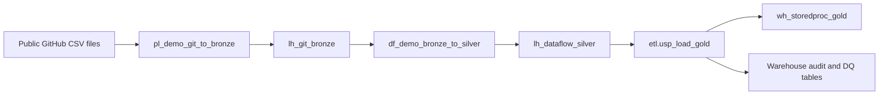

# Multi-engine medallion demo

This solution demonstrates three different Fabric transformation methods without reusing the original solution's Lakehouse, Warehouse, notebook, pipelines, or Dataflow:



| Layer | Fabric item | Technique |
|---|---|---|
| Bronze | `lh_git_bronze` | Dynamic Pipeline Copy plus parameterized Spark notebook |
| Silver | `lh_dataflow_silver` | Dataflow Gen2 Power Query cleansing and typed Lakehouse destinations |
| Gold | `wh_storedproc_gold` | Transactional T-SQL stored procedure with cross-database Silver reads |

`pl_demo_end_to_end` runs the three methods in order. `pl_demo_git_to_bronze` remains independently runnable to show the control-table pattern.

## Bronze

The public Git control manifest contains seven enabled entities, source paths, target names, load modes, keys, and optional watermarks. The child pipeline performs:

1. Lookup the Git-hosted control CSV.
2. Filter enabled rows.
3. Iterate sequentially to avoid Spark pressure on small capacities.
4. Copy each CSV unchanged into `Files/landing/<entity>`.
5. Run `nb_demo_bronze_load` to preserve raw values as text and append lineage columns.

The notebook supports truncate-reload and incremental Delta merge behavior. It writes `bronze_ingestion_audit` alongside the seven Bronze tables.

## Silver

`df_demo_bronze_to_silver` contains seven visible Power Query queries and seven hidden Lakehouse output-destination queries. It:

- trims whitespace and control characters;
- standardizes identifiers, casing, and category labels;
- safely converts dates, timestamps, integers, and decimals;
- retains malformed rows with null conversions instead of silently dropping them;
- adds `dq_is_valid` to every Silver table;
- replaces the Silver tables on refresh for deterministic demonstrations.

## Gold and audit

`etl.usp_load_gold` loads valid Silver records into:

- `gold.dim_date`
- `gold.dim_region`
- `gold.dim_station`
- `gold.dim_tariff`
- `gold.fact_station_daily`
- `gold.fact_assistance_request`
- `gold.fact_asset_workorder`

The same stored procedure writes operational evidence to:

- `audit.pipeline_run`: overall status, timing, and error text;
- `audit.pipeline_step`: source, target, and rejected counts by entity;
- `audit.row_reconciliation`: balance checks for each loaded table;
- `audit.data_quality_result`: rule severity, evaluated rows, failures, and pass/fail status.

The quality rules cover malformed station identifiers, negative passenger counts, invalid tariff bands, unknown stations, fulfilled requests exceeding request counts, reversed assistance timestamps, and invalid work-order date sequences. Expected bad records remain visible in Silver and are excluded from Gold.

## Monitoring queries

```sql
SELECT TOP (20) *
FROM audit.pipeline_run
ORDER BY started_at_utc DESC;

SELECT *
FROM audit.pipeline_step
WHERE run_id = '<pipeline-run-id>';

SELECT *
FROM audit.row_reconciliation
WHERE run_id = '<pipeline-run-id>';

SELECT entity_name, rule_name, severity, evaluated_rows, failed_rows, status
FROM audit.data_quality_result
WHERE run_id = '<pipeline-run-id>'
ORDER BY severity, entity_name, rule_name;
```

## Deployed item IDs

| Item | ID |
|---|---|
| `lh_git_bronze` | `3f5f38ac-8b47-480b-b6a8-588b2b340733` |
| `lh_dataflow_silver` | `6f7334e1-46a1-47af-a47e-ad32ffc66cbd` |
| `wh_storedproc_gold` | `3c3ff6bf-2d9b-4f9f-b914-6a6e6e37e055` |
| `nb_demo_bronze_load` | `30a9e966-3e9a-4555-9bfb-307263c1bde2` |
| `pl_demo_git_to_bronze` | `e99f5fa9-ce72-4de7-a36b-cf2d78d0e3a4` |
| `df_demo_bronze_to_silver` | `8512a02e-02f8-45d0-a599-1140ad75c3d3` |
| `pl_demo_end_to_end` | `670d3d7d-93c4-4118-9d38-882fd1f0988c` |